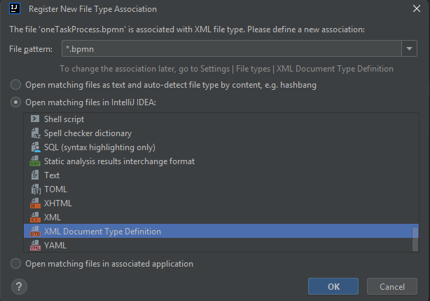
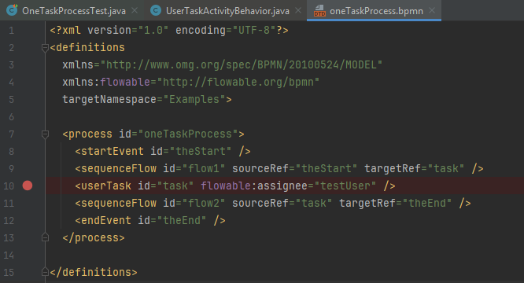
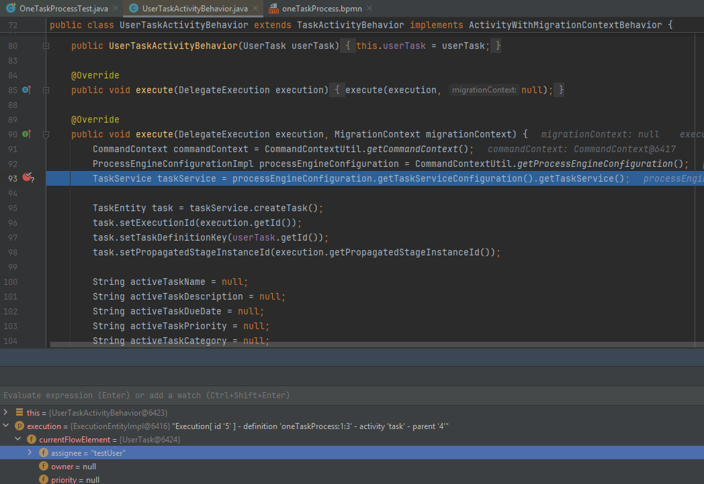

#  CRP XML Debugger

XML Debugger is an IntelliJ plugin that enables debugging of XML-based workflow languages executed in Java environments 
— such as Flowable, Camunda, and Activiti. It supports standards like BPMN and CMMN, with a default configuration tailored for Flowable. 

## 🚀 Getting Started
1. Install the plugin in Intellij IDEA,
2. Associate bpmn, cmmn (or any other xml based language file) with XSD extension.



3. Set a breakpoint in your BPMN or CMMN file — for example, inside a <userTask> element:



If you run the bpmn process with JVM in the debug mode, the execution stops on the Activity behavior ready 
to execute the user task.



## ⚙️ How It Works
The plugin maps XML breakpoints to Java breakpoints with custom conditions.
When you set a breakpoint in XML, the plugin:
1. Locates the corresponding XML tag (e.g., <userTask>),
2. Creates a Java breakpoint in the target class and line,
3. Applies a dynamic Groovy expression as a breakpoint condition.

A sample configuration looks like this:
```json
{
      "xmlTag": "'userTask'.equals(xmlTag.name)",
      "className": "org.flowable.engine.impl.bpmn.behavior.UserTaskActivityBehavior",
      "lineNumber": 92,
      "condition": "'\"'+xmlTag.getAttribute('id').getValue() +'\".equals(execution.getActivityId()) && \"'+ xmlTag.getTreeParent().getAttribute('id').getValue()+ '\".equals(execution.getProcessDefinitionKey())'"
    }
```
`xmlTag` is a groovy condition for identifying `com.intellij.psi.xml.XmlTag` to which mapping is related to. 
`className` and `lineNumber` are identifying place where to put the java breakpoint. The condition is a
string groovy expression, which provides condition to set for given breakpoint. The condition expression from 
the previous code snippet is evaluated into:

```groovy
"task".equals(execution.getActivityId()) && "oneTaskProcess".equals(execution.getProcessDefinitionKey())
```

## 💡 Benefits
1. Restores debugging capabilities for Flowable, which were removed from the open-source edition after version 7.0.0.
2. Works across multiple workflow engines — Flowable, Camunda, and Activiti.
3. Does not alter runtime behavior (unlike Flowable Enterprise, which injects artificial wait states). 
4. Enables transparent, synchronized XML ↔ Java debugging.

## 🤝 Contributing
Contributions are very welcome!
🐞 Report issues, bugs, and feature requests
💡 Propose or implement improvements
🔧 Extend configuration for other XML-based workflow formats