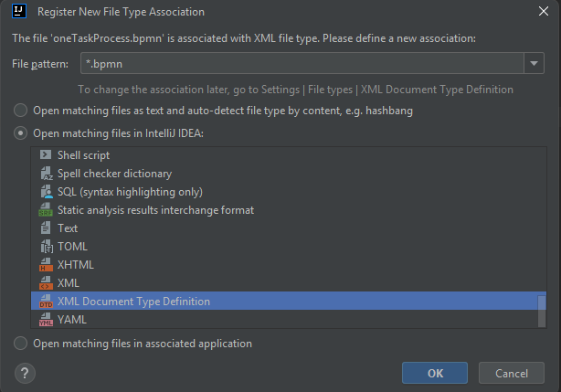
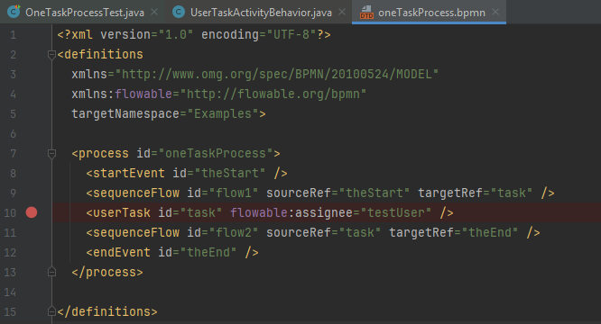
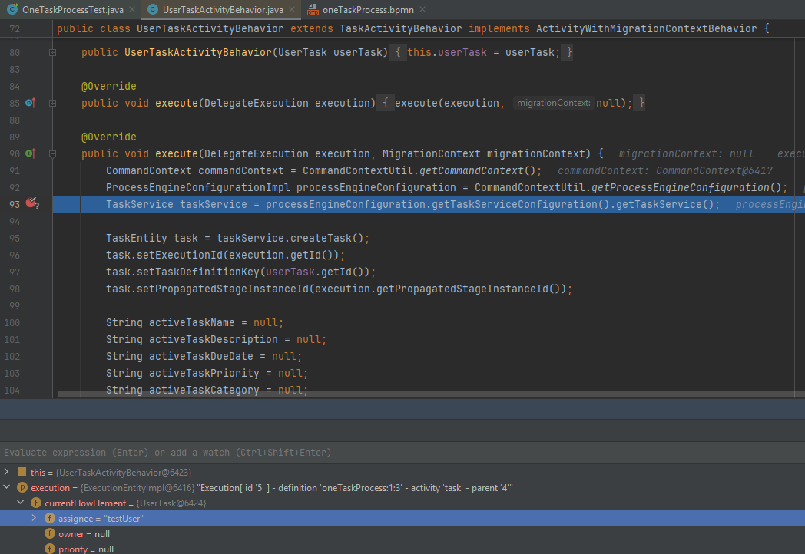

#  CRP XML Debugger

An IntelliJ plugin that enables debugging of XML-based workflow languages (BPMN, CMMN, etc.) in Java environments. It supports workflow engines such as Flowable, Camunda, and Activiti, with a default configuration tailored for Flowable.

## 🚀 Getting Started

1. Install the plugin in IntelliJ IDEA
2. Associate BPMN, CMMN (or any other XML-based language file) with the XSD extension:

   

3. Set a breakpoint in your BPMN or CMMN file—for example, inside a `<userTask>` element:

   

When you run the BPMN process with the JVM in debug mode, execution stops at the Activity behavior, ready to execute the user task:



## ⚙️ How It Works

The plugin maps XML breakpoints to Java breakpoints with custom conditions. When you set a breakpoint in XML, the plugin:

1. Locates the corresponding XML tag (e.g., `<userTask>`)
2. Creates a Java breakpoint in the target class and line
3. Applies a dynamic Groovy expression as a breakpoint condition

A sample configuration:

```json
{
  "xmlTag": "'userTask'.equals(xmlTag.name)",
  "className": "org.flowable.engine.impl.bpmn.behavior.UserTaskActivityBehavior",
  "lineNumber": 92,
  "condition": "'\"'+xmlTag.getAttribute('id').getValue() +'\".equals(execution.getActivityId()) && \"'+ xmlTag.getTreeParent().getAttribute('id').getValue()+ '\".equals(execution.getProcessDefinitionKey())"
}
```

The `xmlTag` field is a Groovy condition identifying the `com.intellij.psi.xml.XmlTag` that the mapping relates to.
The `className` and `lineNumber` specify where to place the Java breakpoint.
The `condition` is a Groovy expression that evaluates to the breakpoint condition.

For the example above, this evaluates to:

```groovy
"task".equals(execution.getActivityId()) && "oneTaskProcess".equals(execution.getProcessDefinitionKey())
```

## 💡 Benefits

- Restores debugging capabilities for Flowable (removed from the open-source edition after version 7.0.0)
- Works across multiple workflow engines: Flowable, Camunda, and Activiti
- Does not alter runtime behavior (unlike Flowable Enterprise, which injects artificial wait states)
- Enables transparent, synchronized XML ↔ Java debugging

## 🤝 Contributing

Contributions are welcome!
- 🐞 Report issues, bugs, and feature requests
- 💡 Propose or implement improvements
- 🔧 Extend configuration for other XML-based workflow formats
